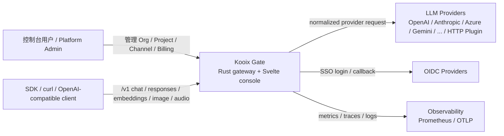
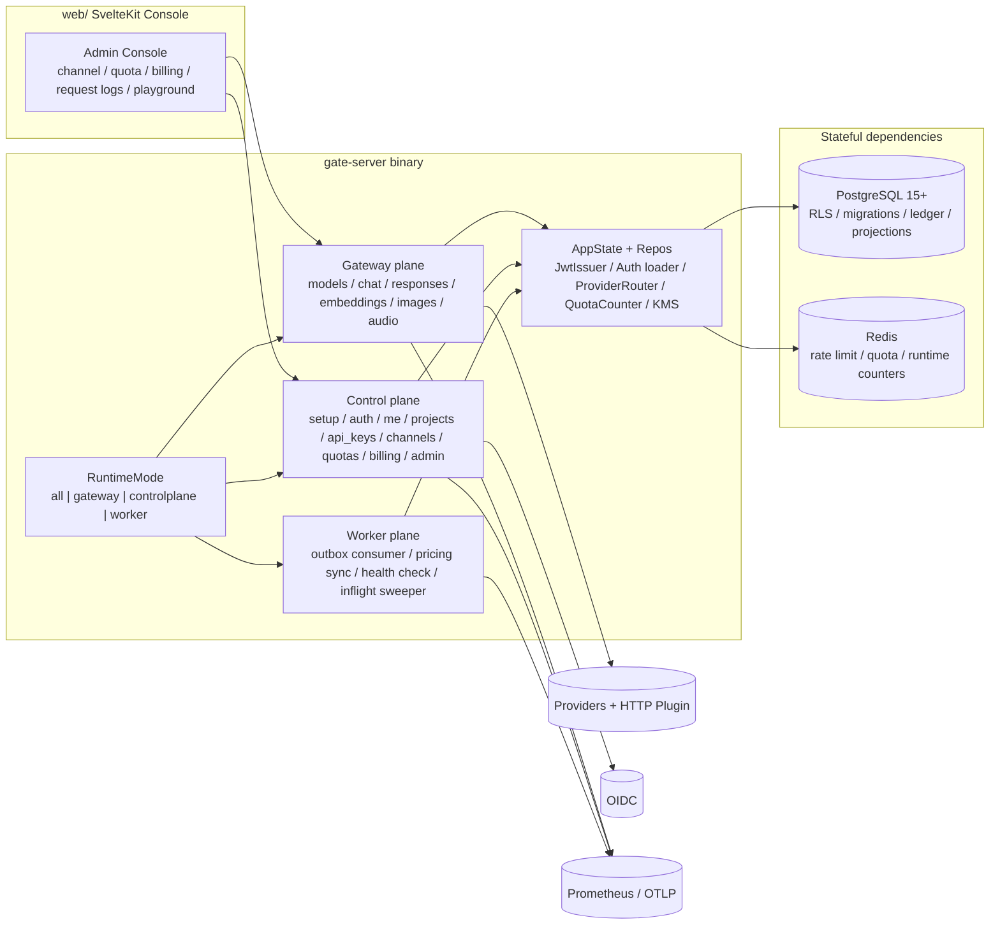
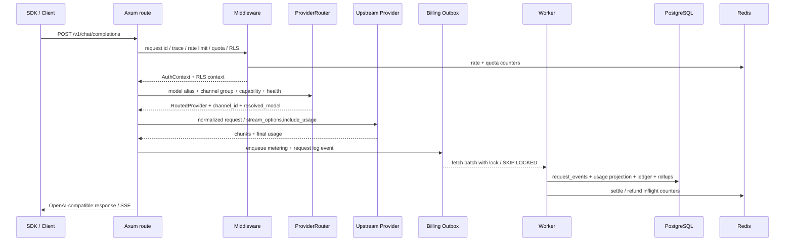

# Kooix Gate 架构总览

Status: active
Scope: 运行时分层、部署形态、核心数据流、代码边界与文档 source of truth。
Last verified: 2026-05-21

本文件是 Kooix Gate 的长期架构入口。`DESIGN.md` 负责解释核心设计原则与领域模型；本文负责回答“系统如何运转、边界在哪里、改代码时先看哪里”。

## 1. 架构意图

Kooix Gate 选择 **single deployable artifact + modular monolith**：保持一个 Rust 二进制和一个 SvelteKit 控制台，但在运行时把职责切成 `gateway / controlplane / worker` 三个面。

这样做是为了对齐优秀基础设施项目的三个习惯：

1. **入口清晰**：新读者先看 README，再看架构总览，再进具体 runbook / module docs。
2. **边界可执行**：架构不是 PPT，`KOOIX_MODE`、route manifest、CI gate 都能守住边界。
3. **扩展不急着微服务化**：先把热路径、管理面、后台任务拆开，再按真实吞吐和团队规模决定是否拆部署单元。

## 2. C4 — System Context



## 3. C4 — Container / Runtime View



## 4. Runtime modes

`KOOIX_MODE` 决定同一个二进制启动哪些面：

| mode | HTTP 服务 | data-plane routes | control-plane routes | worker jobs | 典型用途 |
|---|---:|---:|---:|---:|---|
| `all` | 是 | 是 | 是 | 是 | 本地开发、小规模单节点部署，默认值。 |
| `gateway` | 是 | 是 | 否 | 否 | 热路径水平扩容，只暴露 OpenAI-compatible data plane。 |
| `controlplane` | 是 | 否 | 是 | 否 | 管理台 / 管理 API 单独扩缩容。 |
| `worker` | 否 | 否 | 否 | 是 | 后台消费、探活、同步、预扣回收。 |

运行时证据：

- `crates/gate-server/src/modes.rs`：`RuntimeMode`、`KOOIX_MODE` 解析和 router 选择。
- `crates/gate-server/src/app.rs`：`build_gateway_router` / `build_controlplane_router`。
- `crates/gate-server/src/worker.rs`：后台任务只在 `all|worker` 运行。
- `crates/gate-server/src/route_manifest.rs`：route → mode 的静态清单，配合 `scripts/check-route-manifest.mjs` 做 CI 门禁。


## 4.1 子页面导航

- [Data Plane](./architecture/data-plane.md)
- [Control Plane](./architecture/control-plane.md)
- [Worker Plane](./architecture/worker-plane.md)

## 5. Route boundary

### 5.1 Gateway plane

面向 SDK / OpenAI-compatible 客户端的热路径：

- `GET /v1/models`
- `POST /v1/chat/completions`
- `POST /v1/responses`
- `POST /v1/embeddings`
- `POST /v1/images/generations`
- `POST /v1/audio/speech`
- `POST /v1/audio/transcriptions`

设计约束：

- 只做请求准入、路由、适配、执行、计量、结算和最小审计。
- 走 `rate_limit_by_subject -> quota_enforce -> rls_inject` 的 middleware 边界。
- Provider 选择必须通过 `ProviderRouter` / manifest preset / capability matrix，不在 handler 里散写供应商特例。
- 失败 shape 统一为 OpenAI-compatible `{ error: { code, type, message, ... } }`。

### 5.2 Control plane

面向控制台和运营 API：

- auth / SSO / invitation / session
- Org / Project / API Key / Model Alias
- Channel / Channel Group / Provider preset / Plugin manifest
- Pricing / Quota / Billing / Usage / Request logs
- Platform Admin / incidents / audit

设计约束：

- 所有 mutation 走 RBAC `Permission` + `Scope`，平台级操作用 `PlatformAdmin`。
- typed ID 出现在 API response，路径参数用 `FlexUuid` 同时兼容 typed ID 与裸 UUID。
- secret 只走 encrypted slot / KMS / AAD，API、audit、debug 输出必须脱敏。

### 5.3 Worker plane

后台任务不应跟每个 HTTP replica 无脑重复执行：

- billing outbox consumer
- LiteLLM pricing sync
- channel health check / manifest probe
- inflight quota pre-debit sweeper

设计约束：

- DB-backed job 使用 advisory lock / lease 避免重复 owner。
- SIGTERM 通过 `CancellationToken` 关闭。
- worker 指标进入 Prometheus，事故处置写入 `docs/observability-runbook.md`。

## 6. Gateway request flow



关键契约：

- `crates/gate-server/src/gateway.rs` 固定 `GatewayStage`、`MeteringEvent`、`FailurePolicy`。
- billing outbox 是异步 projection 边界；ledger 是计费审计源，`usage_records` 是读模型。
- streaming 缺 usage 末帧时按估算 usage fail-closed 记账，避免静默漏扣。

## 7. Data model boundaries

| 数据域 | 主职责 | Source of truth / projection |
|---|---|---|
| Identity / RBAC | user、session、org/project membership、platform role | PostgreSQL source of truth；JWT 只做短期 access。 |
| Routing | channel、channel_key、channel_group、project binding、provider capability | PostgreSQL source of truth；ProviderRouter 可缓存可替换快照。 |
| Quota / Rate limit | rpm、tpm、budget、concurrent、lifetime | Redis 热计数 + PostgreSQL quota 定义；inflight 表负责 crash recovery。 |
| Billing | pricing rules、outbox、ledger、invoice | `billing_ledger_events` 是审计源；rollups / usage 是 projection。 |
| Request logs | 请求级排障与 dashboard | `request_events` 幂等源 + `request_log_events` 分区 read projection。 |
| Plugin manifest | 私有协议接入与安全边界 | `model_mapping.plugin` 存储入口；manifest v1 schema / lint / replay 做验证。 |

## 8. Deployment shapes

### 8.1 Small deployment

```text
KOOIX_MODE=all
1 x gate-server
1 x PostgreSQL
1 x Redis
```

适合本地、demo、小规模试运行。优点是简单；缺点是 worker、control、gateway 共用同一进程资源。

### 8.2 Split runtime deployment

```text
N x KOOIX_MODE=gateway       # hot data plane
1-2 x KOOIX_MODE=controlplane # admin/API console
1-2 x KOOIX_MODE=worker       # outbox/pricing/health/inflight
shared PostgreSQL + Redis
```

适合流量升高后扩容。优先扩 `gateway`；worker 依据 outbox backlog、pricing sync lag、health probe lag 调整。

### 8.3 Release / rollback hooks

发布与回滚不写在本文，统一看：

- `RELEASE.md`：发布命令、迁移前置检查、Docker image tag、回滚策略。
- `docs/observability-runbook.md`：上游全挂、Redis 不可用、Postgres 慢查询、pricing sync 失败、outbox backlog。
- `docs/security-runbook.md`：master key、JWT secret、channel key、Redis quota、Plugin 风险处置。

## 9. Architecture decision log

| 决策 | 当前选择 | 理由 | 未来触发条件 |
|---|---|---|---|
| 单体 vs 微服务 | single binary + runtime modes | 降低运维复杂度，同时让热路径和后台任务可拆。 | gateway/control/worker 需要独立发布、独立限权或独立语言栈。 |
| SQL vs NoSQL | PostgreSQL + optional TimescaleDB | 强一致、RLS、ledger、迁移可审计。 | request log / usage 分析写入量超过普通 PG 分区承载。 |
| Cache / counter | Redis | rate/quota 热计数需要低延迟原子 Lua。 | 需要跨区域强一致或 Redis 成本成为主瓶颈。 |
| Provider 扩展 | compile-time provider + HTTP Plugin manifest | 主流渠道强类型，私有渠道靠 manifest 快速接入。 | manifest 无法表达 deterministic transform 时启用 WASM vNext。 |
| Billing | outbox + ledger + projections | 热路径不直接做重 projection，计费可重放可对账。 | 需要跨账期复杂金融账本时引入独立 accounting service。 |

## 10. 文档边界

| 文档 | 职责 |
|---|---|
| `README.md` | 项目定位、能力速览、Quick Start。 |
| `DESIGN.md` | 设计原则、领域模型、权限/配额/计费等核心决策。 |
| `docs/architecture.md` | 系统架构、运行模式、关键流、部署形态。 |
| `docs/plugin-manifest.md` | HTTP Plugin manifest v1 schema、示例和安全约束。 |
| `docs/threat-model.md` | 威胁模型与安全边界。 |
| `docs/observability-runbook.md` | 指标、告警、事故处置。 |
| `docs/stages/` | 已完成阶段证据，不作为当前 source of truth。 |
